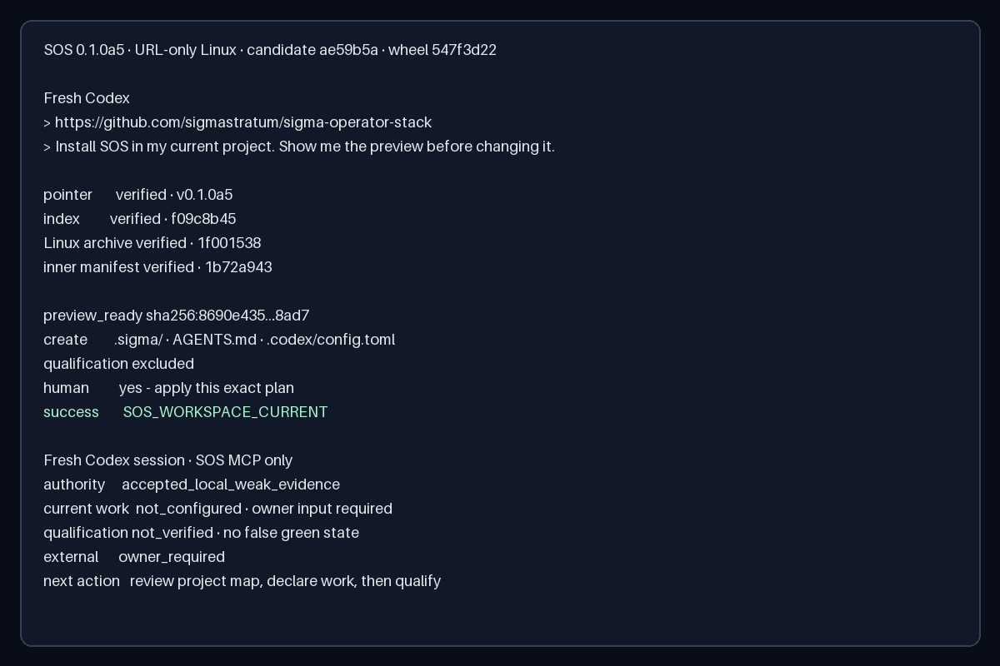

# SOS

**Project state for coding agents.**

> **Agent installation entrypoint:** open [`INSTALL.md`](INSTALL.md), then fetch
> [`release/current.json`](https://raw.githubusercontent.com/sigmastratum/sigma-operator-stack/main/release/current.json)
> directly. GitHub search, snippets and cached repository pages are not release
> authority and cannot prove that the pointer is absent.

**Current installable Community alpha: `0.1.0a5`. Linux is the primary
promotion path.** Older releases remain
available as history but are not current installation authority.

Fresh coding-agent sessions often resume from stale chat context, an old green
check, or the wrong local instructions. SOS records accepted project state in
the repository, detects when it is no longer current, and returns one safe
next action.

> **Community alpha · Linux and macOS release route.** The checked-in release
> pointer selects one exact tagged artifact for each admitted platform. If the
> tag or any bound asset is unavailable, Codex stops without substituting a
> branch, source archive, or private bundle.

## See the recovery loop



The [current narrated demo](demo/recovery-demo.mp4) and its
[text transcript](demo/transcript.md) show the exact `0.1.0a5` Linux path:
URL-only discovery, release verification, one project preview, explicit human
confirmation, installation, and genuinely fresh-session recovery. Its
content-safe receipt is bound to product candidate `ae59b5a`, the release
archive and wheel. Platform-specific support remains bounded by the matrix
below.

## Install with Codex

Give this repository URL to Codex and say:

> **Install SOS in my current project. Show me the preview before changing it.**

The [canonical installation route](docs/install-with-codex.md) makes Codex
verify one exact platform release and prepare setup. You remain the only
person who can approve repository mutation or choose project authority.

The expected results are:

- one aggregate preview before SOS writes managed files;
- truthful `current`, `stale`, `not_configured`, or `not_verified` state;
- a fresh Codex session recovers current work and one safe next action.

Candidate scope: **Codex-first · Linux x86_64 primary path · unsigned
experimental macOS 14+ Apple Silicon control plane · Windows 11 x86_64
pending Store lifecycle · local-first · no telemetry**.

[Limitations](#support-matrix) · [Security](SECURITY.md) ·
[Uninstall and preservation](docs/version-update.md#removal)

SOS is a local-first Community alpha with no telemetry. It helps a genuinely
fresh coding-agent session recover accepted project state, detect stale or
unverified work, and receive one safe next action without relying on the
previous chat. Unsupported, ambiguous, `not_configured` and `not_verified`
states are never presented as green.

> **Release activation is fail closed.** `release/current.json` is the only
> installation authority, but its presence alone is not enough: its immutable
> tag, index, artifact size, digest, inner manifest and checksums must all be
> available and agree. Otherwise stop. Never install from a branch tip, GitHub
> source archive, issue command, raw installer file, or private test bundle.

Sigma Operator Stack is the formal project name. SOS does not replace your
repository, issue tracker, existing `AGENTS.md`, or governance framework. It
discovers them, previews the exact managed change, and fails closed when
authority is ambiguous.

The reproducible sample in
[`examples/fresh-agent-recovery/`](examples/fresh-agent-recovery/README.md)
shows the product outcome:

1. SOS discovers an existing project and preserves unrelated agent settings.
2. One preview and one confirmation install the local control plane and Codex
   adapter.
3. Qualification is a separate, explicit step.
4. A fresh session recovers accepted state and the next allowed action.
5. A later source change is detected as stale instead of silently trusted.

The recording combines three explicitly approved Codex turns—preview,
confirmed installation and fresh recovery—with one approved narration call.
No raw task, response, tool result, session identifier, account data, or host
path is retained.

There is one public installation route. The released platform launcher
owns its declared Python, `uv`, and package dependencies; the developer does
not repair PATH or install them manually.

Installation and qualification are deliberately different operations. Setup
may finish with `not_configured` or `not_verified`. Project checks run only
after a separate human-reviewed qualification proposal.

Invited private-alpha testing is not public installation authority. The
historical tester note at [`docs/alpha-quickstart.md`](docs/alpha-quickstart.md)
contains no alternative public command sequence.

## Three failures SOS prevents

### A fresh agent guesses the project state

SOS binds accepted authority, policy, source observation, and current work to
append-only records. The next session reads those records instead of guessing
from chat history.

Limit: SOS recovers only state that was explicitly accepted and recorded; it
does not infer missing project truth from source code or chat history.

### Changed source is treated as already verified

Every authoritative read re-observes the application fingerprint. A changed
tracked, staged, unstaged, untracked, deleted, symlink, or bounded submodule
state becomes stale and returns an exact next action.

Qualification is also bound to the exact installed SOS package identity. An
upgrade or downgrade preserves historical receipts but makes their green state
stale until each project is rebound, Codex is restarted, and qualification is
run separately. See [version update and downgrade](docs/version-update.md).

Limit: the alpha qualifies only registered check families and cannot certify
model quality, production behavior, or checks outside the declared profile.

### Installation overwrites an existing stack

`sos compatibility` discovers known agent and governance surfaces and marks
each relevant object `preserve`, `append`, `create`, or `block`. Competing
authority systems require an explicit primary choice. Foreign managed bytes,
collisions, filesystem uncertainty, and changed previews stop without
overwrite.

Limit: recognized surfaces are classified; unknown frameworks are preserved
but remain outside the compatibility claim.

## Support matrix

`Observed` means an exact artifact ran in that environment. `Release claim`
is the smaller compatibility promise that may become active only after a
candidate-bound public release pointer exists. Observation never silently
expands the claim.

| Environment | Observed | Release claim | Current result |
| --- | --- | --- | --- |
| Native Linux x86_64 on a local filesystem, Python 3.11/3.12, Landlock ABI >= 3 and required seccomp | Independent native lifecycle and qualification controls passed | Control plane plus registered Python qualification | Admitted only through the exact tagged archive selected by the release pointer |
| macOS 14+ Apple Silicon on local APFS | Native install, smoke, same-version update, and removal passed; `.sigma` preserved | Unsigned/not-notarized control-plane alpha; one `Open Anyway` approval may be required | Admitted only through the exact tagged archive; executable qualification remains unsupported |
| Windows 11 x86_64 on local NTFS, UAC enabled, ordinary Medium Integrity user | Exact MSIX content built and accepted into Microsoft Store certification | Pending | Store-signed install/update/remove and clean-user lifecycle are not yet proven |
| Windows with UAC disabled, elevated execution, non-owner profile storage, shared/network filesystem, or sandbox identity targeting another profile | Typed refusals observed | Unsupported | SOS stops before project mutation |
| Docker Desktop on a WSL2 kernel exposing Landlock ABI 1 | Capability diagnostic recorded | Control plane only | Executable unittest is unsupported and fails closed |
| Native Ubuntu WSL2 | No complete native evidence | Unverified | Not a release target |
| Agents other than Codex | Not qualified | Unverified | Control plane is agent-neutral; the alpha adapter is Codex-first |
| Languages/check families beyond registered Python syntax and unittest | Not qualified | Unsupported | Future families require an explicit registry and isolation contract |
| Package network and telemetry | Launcher acquisition is bounded; SOS entrypoint counters remained `0/0/0` in qualified runs | No network or telemetry after verified handoff | Release evidence must bind the exact platform launcher |
| Existing agent/governance files | Preserve/append/create/block and collision fixtures passed | No silent overwrite | Semantic ambiguity requires an owner choice |

The public Community Alpha archives pin managed Python `3.12.14` and `uv 0.12.6`.
Exact Git and Codex versions are artifact-specific and must be frozen in the
public release index before any broad compatibility claim. The Codex adapter
exposes exactly eight read/proposal MCP tools.

On Linux, `sos capabilities --json` reports the exact local qualification
profile decision. Exit `0` means the complete named profile is available; exit
`2` gives a typed unsupported reason. Windows and macOS control-plane support
does not imply executable qualification support.

## Coexistence with an existing project

SOS preserves existing files by default. It recognizes root and nested
`AGENTS.md`, `.codex`, `.sigma`, OpenSpec, BMAD, spec-kit, and known governance
roots. It does not merge competing policies or print existing file contents.

```bash
sos compatibility PATH
sos init --with-codex --primary-authority '<discovered-id>' PATH
```

The primary-authority option is accepted only when the compatibility result
requires it. Unknown frameworks are preserved but remain outside the alpha
compatibility claim.

## Trust boundary

- Reads bounded repository metadata, Git state, SOS records, and recognized
  agent/governance surfaces; it does not serialize their raw contents.
- Writes only previewed SOS records and exact managed integration targets after
  the user's confirmation.
- Local and offline after package acquisition; no telemetry.
- Exact eight-tool MCP surface with no shell, accept, qualify, commit, push,
  deploy, or production mutation tool.
- One observed-terminal confirmation for managed writes.
- Digest-bound previews, receipts, successor lineage, and stale detection.
- Package-bound qualification currentness across upgrade and downgrade; setup
  rebind alone cannot manufacture green.
- Qualification runs only through a registered fixed command and a named
  fail-closed isolation profile.
- User files are restored byte-for-byte on safe setup removal; `.sigma`
  project records are preserved.
- Cannot prevent a user, another process, or an unrestricted coding agent from
  changing files outside SOS; it detects relevant drift on the next observed
  operation and fails closed.

Read the public [architecture overview](docs/architecture.md),
[threat model](docs/threat-model.md), and
[contracts and integrity](docs/contracts-and-integrity.md). The
[factual comparison](docs/comparison.md) explains what SOS complements rather
than replaces. Expected refusals
are indexed in [troubleshooting](docs/troubleshooting.md).

## Current capabilities and next milestones

The [public roadmap](docs/roadmap.md) tracks Community capability maturity
only. It intentionally excludes private planning and commercial commitments.

## Contributing and support

- Try the supported journey and tell us where it became unclear or stopped.
  Share only typed reason codes and a synthetic reproducer—never private
  source, prompts, raw `.sigma`, credentials, customer data, or host paths.
- Reproducible bugs and bounded proposals: GitHub Issues.
- Alpha feedback: [`docs/alpha-feedback.md`](docs/alpha-feedback.md).
- Security reports: GitHub private vulnerability reporting only.
- Contribution rules: [`CONTRIBUTING.md`](CONTRIBUTING.md).
- Support boundary: [`SUPPORT.md`](SUPPORT.md).

Licensed under the [Apache License 2.0](LICENSE).
